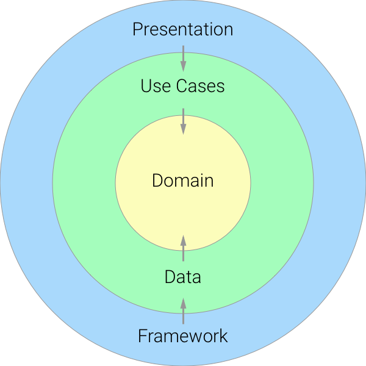

# Comment Analyzer

## Architecture

- 

- 

- 

- The `domain`:
    * `model` represent to application business core
    * `usecase` provide the interaction with `data` for `app` UI
- The `data`:
    * Provide data:
        * Can get from remote source and map raw data model to business model
- Main `app`:
    * Apply Dependency Injection by using Hilt

## Code folder structure

- 
    * Contains: `domain`, `data`, and main `app`
    * `app` contains:
        * `deps`: define dependency injection with application scope
        * `feature`: separate application into many features will make it be easier on scaling up
## Framework, library
- Libraries/frameworks using in the application:
    * Hilt
    * RxJava
    * Jsoup
- Required configurations:
    * AndroidSDK
    * Gradle 7.4